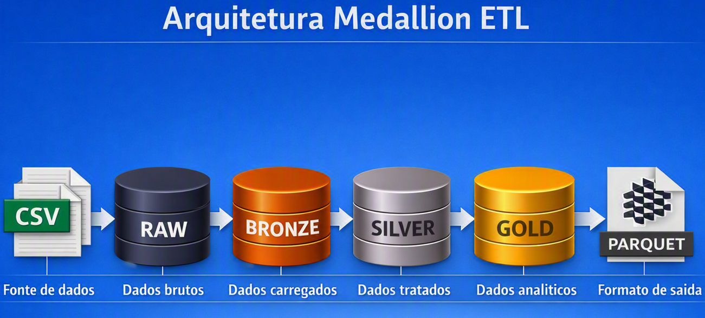
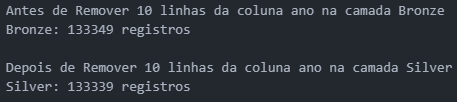
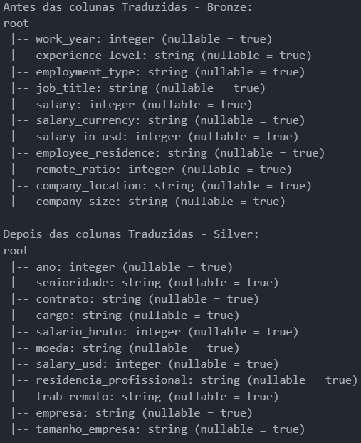
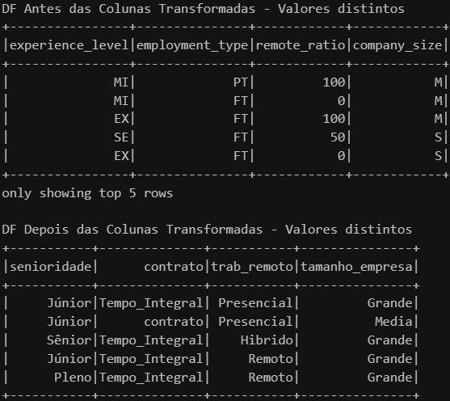
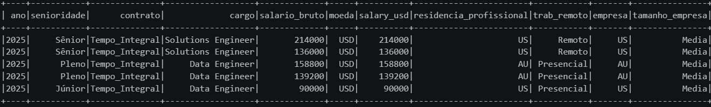

# ETL_SALARIOS_TI - Arquitetura Medallion com PySpark

## 📌 Descrição
Este projeto realiza um processo de **ETL (Extract, Load, Transform)** sobre uma base de dados global de salários de profissionais de TI.  
O objetivo é **normalizar e padronizar** os dados para que a área de negócios possa realizar análises e descobrir insights relevantes.

---

## 🔎 Profiling e etapas do ETL

- **Validação da quantidade de registros** da fonte de dados.
- **Identificação e remoção de registros nulos** na coluna `ano`.
- **Tradução dos nomes das colunas** para português.
- **Conversão das siglas categóricas** para nomes mais compreensíveis.
- **Apresentação de exemplos antes e depois** das principais transformações realizadas.
- **Criação da camada Gold**, contendo uma tabela analítica com utilizada para responder às perguntas de negócio.
- **Persistência da tabela analítica em formato PARQUET**, proporcionando maior eficiência no armazenamento e na leitura dos dados para consumo analítico.

## 🏗️ Arquitetura Medallion
Neste projeto, as camadas **Bronze** e **Silver** são mantidas em memória durante o processamento do notebook, sendo utilizadas como etapas intermediárias do pipeline. 
**Em ambientes profissionais, essas camadas normalmente devem ser persistidas em uma camada de armazenamento, garantindo durabilidade, rastreabilidade, reprocessamento e independência entre as etapas do pipeline**. 
A camada Gold deste projeto é persistida em formato **PARQUET** para consumo analítico.

---

## 🎯 Objetivos do ETL
- Identificação e remoção de registros com valores nulos na coluna ano (10 registros removidos).
- Tradução dos nomes das colunas para português, tornando o dataset mais legível.
- Padronização de **4 colunas categóricas**:
  - `senioridade`
  - `contrato`
  - `trab_remoto`
  - `tamanho_empresa`

---

## 🛠️ Transformações realizadas
- **Coluna `contrato`**:  
  - FT → Tempo Integral  
  - PT → Parcial  
  - CT → Contrato  
  - FL → Freelancer  

- **Coluna `trab_remoto`**:  
  - 0 → Presencial  
  - 50 → Híbrido  
  - 100 → Remoto  

- **Coluna `tamanho_empresa`**:  
  - S → Pequena  
  - M → Média  
  - L → Grande  

- **Coluna `senioridade`**:  
 - EX → Executivo
 - EN → Júnior
 - SE → Sênior
 - MI → Pleno

## 📊 Exemplo de transformação

Removendo 10 Linhas nulas da coluna ano

Colunas Padronizadas English to Português:

Distribuição da coluna `tamanho_empresa` antes e depois da tradução:

## 📊 Amostra geral do ETL depois de finalizado
Resultado do processamento:

## Camada Gold
A camada Gold representa a etapa final do processo de transformação e disponibiliza os dados preparados para consumo analítico. 
Neste projeto, a camada **Gold** é selecionada e persistida em formato **PARQUET**, formando a tabela utilizada nas análises e na resposta às perguntas de negócio.

A camada **Gold** não tem como objetivo realizar novas transformações estruturais; seu propósito é disponibilizar um conjunto de dados já tratado, padronizado e pronto para análise.

## 📂 Dados de origem e saída

O dataset de origem contém **133.339 registros**. O processo de ETL realiza as etapas de **ingestão, tratamento e transformação** dos dados nas camadas **Bronze** e **Silver**, preservando os registros ao longo do processamento.
Ao final, a camada **Gold** disponibiliza uma tabela analítica com os **133.339 registros processados**, persistida em formato **Parquet**. 
Esse dataset é utilizado como base para o projeto de análise e para responder às perguntas de negócio.

A tabela analítica gerada neste projeto será utilizada como fonte para o projeto [**ANALISE-SALARIOS-TI-databricks**](https://github.com/jhenivon/ANALISE-SALARIOS-TI-databricks), desenvolvido no **Databricks**, onde os dados são utilizados para análises e geração de visualizações.

## 👤 Autor

**Genivon Silva**

**Engenheiro de Dados**
- 💻 GitHub: [Genivon Silva](https://github.com/jhenivon)
- 🔗 LinkedIn: [Genivon Silva](https://www.linkedin.com/in/genivon-silva-69bb9b9b/)